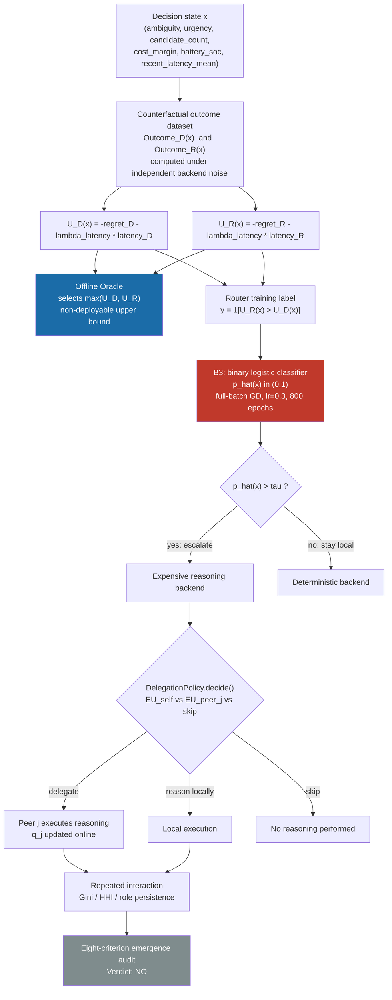
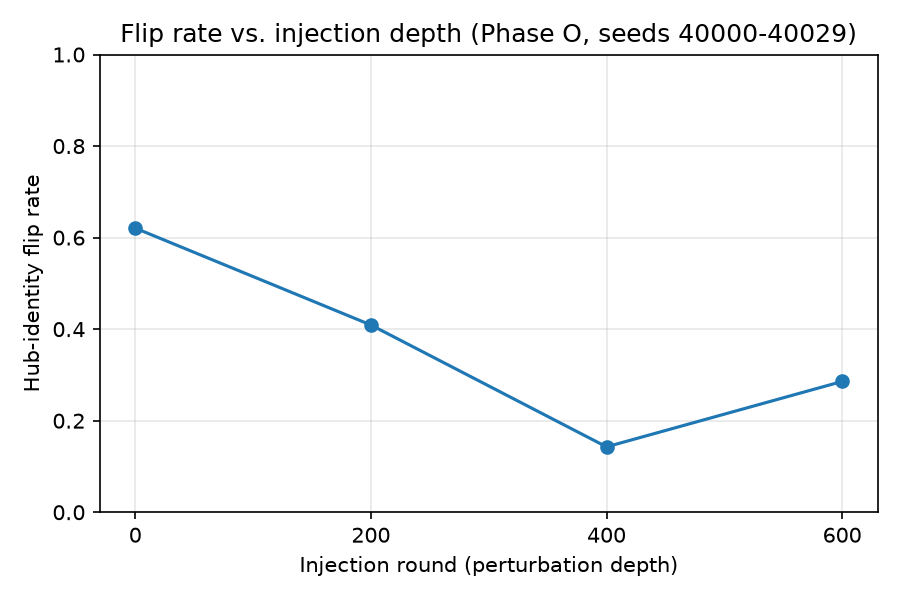
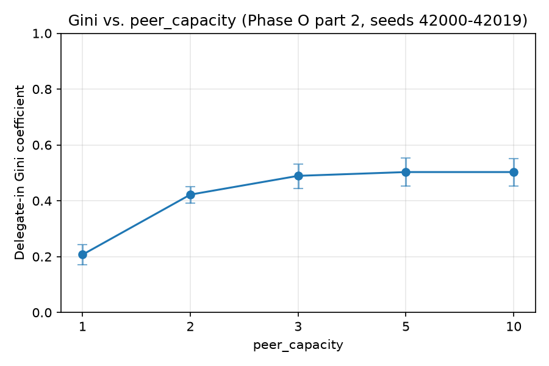

# RACA-Collective

[](https://doi.org/10.5281/zenodo.21960745)
[](https://github.com/Pouya-Mansournia/RACA-Collective-Public/actions/workflows/tests.yml)
[](LICENSE)
[](pyproject.toml)

From Reasoning Allocation to Behavioral Specialization: Boundary Results in Multi-Robot Systems.

This is Paper 3 in a research arc that started with:

1. Reasoning has operational cost (warehouse-amr-emergent-agents).
2. Reasoning should be allocated selectively according to context (RACA).
3. This project: can a fleet learn when reasoning is worth its cost, decide who should reason, and develop useful collective organization without predefined roles?

This repository contains the implementation, test suite, experiment scripts, archived results, and analysis code behind that work, so the results can be reproduced independently.

## Headline findings

The Offline Oracle shows positive-value reasoning opportunities are intrinsically sparse in the evaluated environment (escalation rate 0.14-2.06% across regimes). Within that sparse-opportunity regime, a learned binary router (B3) avoided a hand-tuned heuristic's over-escalation and looked, on an aggregate regret metric, like it had learned when reasoning helps. Direct verification of the archived output shows otherwise: on every held-out, in-distribution evaluation, B3's escalation rate is exactly 0.0% and its utility and regret are numerically identical to a policy that never reasons at all. The router did not learn to discriminate the rare decisions worth reasoning about; it collapsed to the always-deterministic policy. This is a sparsity/learnability boundary result, not a positive routing result, and it should not be read as one.

Peer-to-peer cognitive delegation produces no measurable benefit in calibrated homogeneous fleets. It shows a benefit under a designed capability asymmetry (heterogeneous fleet), but no matched no-delegation control was run for that condition, so the benefit cannot be attributed to delegation itself rather than to the advantaged robots' properties alone.

Repeated interaction under an uncalibrated delegation policy produces a real, path-dependent concentration of delegated work. A matched, same-seed control comparison attributes roughly one third of the originally observed concentration to two implementation artifacts (an RNG-seeding pattern and deterministic tie-breaking), not the majority an earlier internal narrative had suggested. The residual that survives these controls is statistically real (non-overlapping confidence intervals against a null model) but does not satisfy this project's own eight-criterion test for emergent collective cognition: it delivers no measurable fleet-level benefit once the routing gate is calibrated.

The manuscript describing this work in full is in preparation; this repository will be updated with a citation once it is available.

## Architecture



Each decision state is scored under both backends via counterfactual outcome sampling, which produces the labels the Offline Oracle and the learned router (B3) are each evaluated against. In every held-out cell B3's threshold check resolves to "stay local," which is the router-collapse result described above: the red node and the gray node in this diagram are the headline findings, not a successful pipeline. Robots that do escalate can delegate to a peer instead of reasoning locally, and repeated delegation over many decisions is what the specialization/emergence analysis (bottom of the diagram) measures.

## Result figures

Generated by `analysis/build_summary_tables.py` from the archived, committed `summary*.json` files (Phase O). Byte-deterministic — see `reproducibility/README.md`.





## Layout

```
src/              environment, agents, reasoning, routing, delegation, memory, communication, evaluation
experiments/      per-phase experiment scripts and archived results
analysis/         result analysis scripts and derived summary tables/figures
tests/
reproducibility/  entry point for re-running the experiments and checks
```

## Quick start

Requires Python 3.13 or 3.14 (verified interpreters; `pyproject.toml` pins `>=3.13,<3.15`).

```
pip install -r requirements.txt   # exact-match numpy (2.5.1) for bit-for-bit reproduction
python3 -m pytest tests/ -q       # run the test suite
python3 analysis/build_summary_tables.py   # rebuild summary tables/figures from archived JSON
```

See `reproducibility/README.md` for the full install/verification notes and the exact command for every experiment phase.

## Reproducing the results

See `reproducibility/README.md` for setup and the exact commands to re-run each phase's experiments and regenerate the summary tables. Each `experiments/phase_*/` directory contains its own run script(s) and the archived `results/`/`summary*.json` output that the reported numbers were computed from.

## Citation

A manuscript describing this work in full is in preparation; this repository will be updated with a citation once it is available. Until then, cite the software itself via `CITATION.cff` or the DOI badge above:

```bibtex
@software{mansournia_raca_collective,
  author  = {Mansournia, Pouya},
  title   = {RACA-Collective},
  doi     = {10.5281/zenodo.21960745},
  url     = {https://doi.org/10.5281/zenodo.21960745},
  license = {MIT}
}
```

## License

MIT — see [LICENSE](LICENSE).

## Rules this project follows

- Emergence is a hypothesis, never hard-coded.
- No phase proceeds without an explicit PASS, FAIL, or documented inconclusive result on the prior phase.
- Negative results are valid and get written up, not discarded.
- A finding that later turns out to be wrong gets corrected in place, with the correction disclosed, not quietly replaced.
